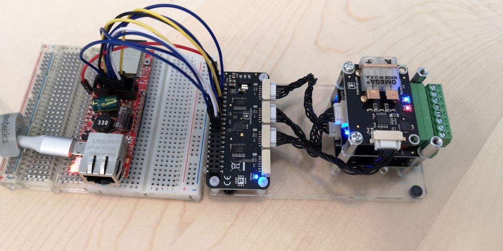

## Tinkerforge C/C++ Bindings for MCU (Demo)

The C/C++ bindings for microcontrollers allow you to control Tinkerforge [Bricks](https://www.tinkerforge.com/de/doc/Hardware/Bricks/Bricks.html) and
[Bricklets](https://www.tinkerforge.com/de/doc/Hardware/Bricklets/Bricklets.html) from your C/C++ programs running on microcontrollers.

This Demo is using [PlatformIO](https://platformio.org/) for compiling your project and
uploading to the microcontroller.

### PlatformIO

#### Using this Repository

```
git clone https://github.com/stif/tf-mcu-bindings-demo.git
cd tf-mcu-bindings-demo/
git submodule init
git submodule update
```
#### Create your own Repository

 * Create a Initial PlatformIO Project via PIO Home
    * Enter a Project Name
    * Select ESP32 Board (eg Olimex ESP32-PoE)
    * choose location of project
 * open a terminal in root folder of the project, and type:
 ```
 git init
 git submodule add https://github.com/stif/tf-hal-arduino-esp32.git lib/hal-arduino-esp32
 git submodule add https://github.com/stif/tf-mcu-bindings.git lib/bindings
 ```

 ### ESP32 SPI Pin Mapping

|SPI	|MOSI	   |MISO	   |CLK	   |CS     |
|-----|--------|--------|--------|-------|
|VSPI	|GPIO 23	|GPIO 19	|GPIO 18	|GPIO 5 |
|HSPI	|GPIO 13	|GPIO 12	|GPIO 14	|GPIO 15|
|Custom|GPIO 13	|GPIO *36*	|GPIO 14	|GPIO 15|

|Mapping |Lolin32 |ESP32-PoE UEXT| ESP32-PoE HAT |HAT Zero   |
|--------|--------|---------|---------|-----------|
|MOSI    |GPIO 13 |GPIO 13  |GPIO  3  |PIN 19     |
|MISO    |GPIO 12 |GPIO 36  |GPIO  35 |PIN 21     |
|CLK     |GPIO 14 |GPIO 14  |GPIO  0  |PIN 23     |
|CS A    |GPIO 32 |GPIO 16  |GPIO  32 |PIN 13     |
|CS B    |GPIO 33 |GPIO 2   |GPIO  33 |PIN 16     |
|CS C    |GPIO 4  |GPIO 4   |GPIO  13 |PIN 18     |
|CS D    |GPIO 5  |GPIO 5   |GPIO  16 |PIN 15     |
|CS HAT  |GPIO 15 |GPIO 15  |GPIO  5  |PIN 22     |




### Official Documentation

For more information about the C/C++ bindings (including setup instructions)
go to:

 * https://www.tinkerforge.com/en/doc/Software/API_Bindings_uC.html (English)
 * https://www.tinkerforge.com/de/doc/Software/API_Bindings_uC.html (German)
